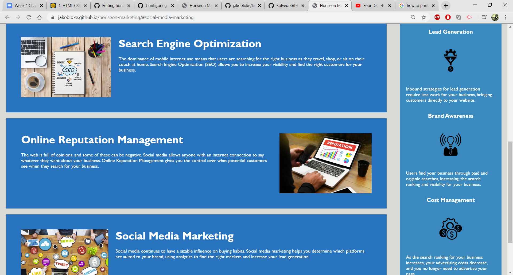

Enclosed in this code is the website for the Horiseon Marketing Company. The index.html file is for the structure of the website as well as images and any text.
The style.css file includes all of the styling for the website.
The links on top of the website will take you to their respective sections.
This is the first weekly challenge for the UC Berkeley Extension Coding Bootcamp.
The website can be found at this link: https://jakobloke.github.io/horiseon-marketing/

Below are screenshots of the website:

